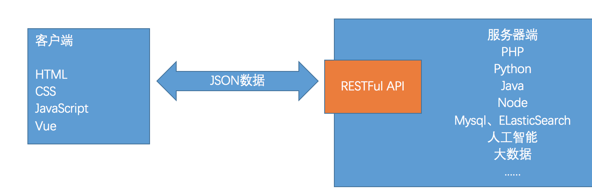
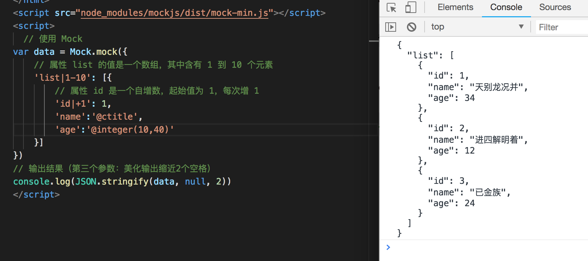
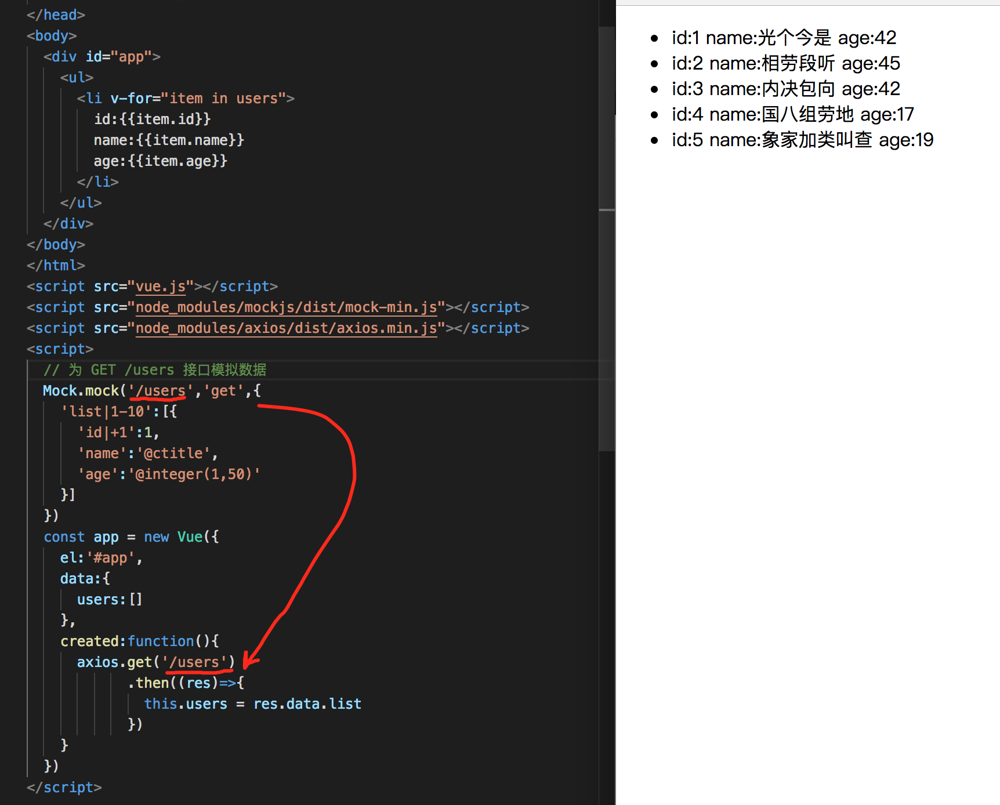
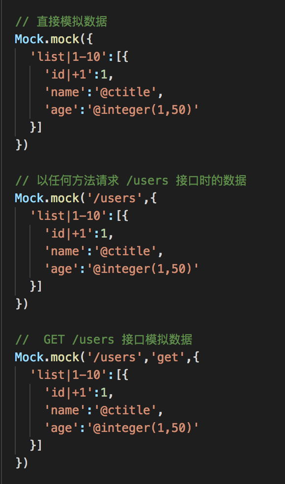
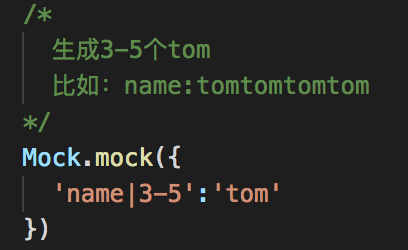
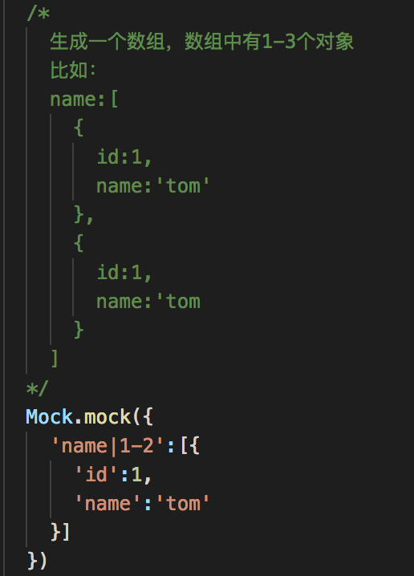
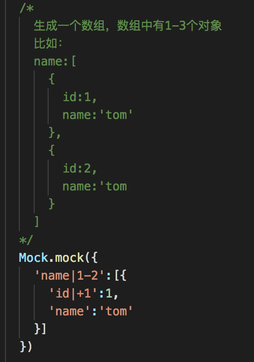
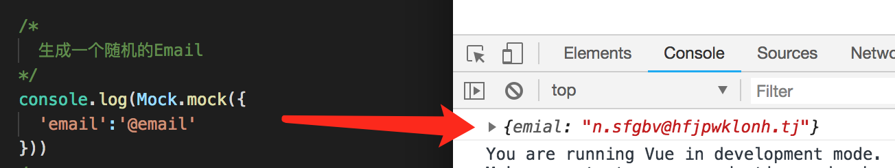
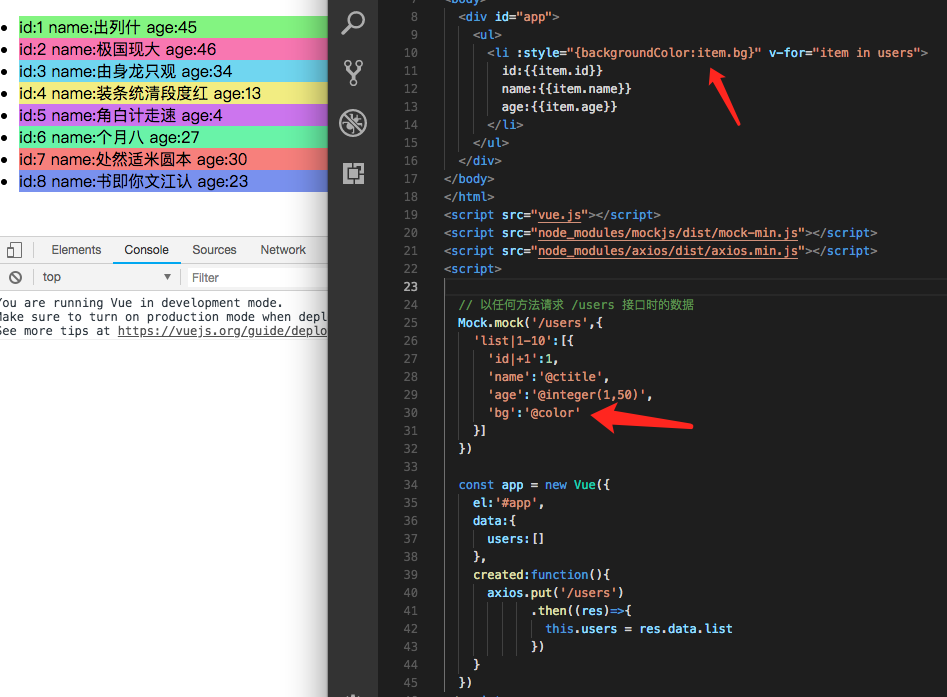

# mockjs介绍


​	在进行前后端分离式的开发中，前端负责制作页面和显示数据，后端负责提供数据，前端通过后端提供的RESTFul规范的接口来获取 JSON 格式的数据：



​	对于前端开发人员来说，必须要从服务器获取数据，所以就只能等待后端开发好接口之后，前端才可以获取数据，这会影响前端开发的效果。

​	聪明的前端开发人员就会想：如果前端可以自己模拟出数据，那么在开发时就不需要服务器提供的数据了。于是就出现了mockjs。

#快速入门

##下载

可以使用 npm 下载 mockjs：

~~~js
npm install mockjs
~~~

该命令会把 mockjs 下载到 node_modules 目录中，页面中引入即可使用：

~~~html
<script src="node_modules/mockjs/dist/mock-min.js"></script>
~~~

##模拟数据

模拟一个用户列表，用户三个字段组件：自增ID、姓名、年龄



## 应用到项目中

​	在项目中，我们可以在执行AJAX之前，使用Mock为接口模拟数据，当执行AJAX时会匹配相应URL的模拟数据：




# 模拟数据

## 设置迟延时间

​	我们可以使用 Mock.setup 来设置模拟数据时的延迟时间，单位：毫秒。可以设置一个固定的时间，也可以使用-设置一个时间段：

~~~js
// 延迟4秒
Mock.setup({
    timeout: 4000
})
// 延迟3~9秒
Mock.setup({
    timeout: '3000-9000'
})
~~~

## 模拟数据

可以使用 Mock.mock 生成模拟数据。

1. 直接生成模拟数据

~~~js
Mock.mock(模板|function)
~~~

2. 为接口地址模拟数据

~~~js
Mock.mock(url,模板|function)
~~~

3. 为接口以及请求方式模拟数据

~~~js
Mock.mock(url,type,模板|function)
~~~

说明：url也可以是一个字符串也可以是一个正则。



## 模板语法

模拟数据时要根据模板来模拟，模板是一个对象类型的值，格式为：

~~~js
'名称|规则':'值'
~~~

名称：模拟的数据的名字。
值：模拟的数据的值。
规则：模拟出数据的规则，常用的几个规则：

1. min-max：生成的范围
2. count：生成的数量
3. +step：递增step



如果值是一个数组，规则代表数组中元素的个数：



如果希望生成的ID自增可以使用+1



##生成随机数据

​	我们一般在模拟数据时都希望生成一些随机的数据，mock中内置了很多种不同类型的随机数据，我们可以使用它们生成各种类型的随机数据：

| Type     | Method                                                       |
| -------- | ------------------------------------------------------------ |
| 基本类型 | boolean, natural, integer, float, character, string, range, date, time, datetime, now |
| 图片     | image, dataImage                                             |
| 颜色     | color                                                        |
| 文本     | paragraph, sentence, word, title, cparagraph, csentence, cword, ctitle |
| 姓名     | first, last, name, cfirst, clast, cname                      |
| 网站     | url, domain, email, ip, tld                                  |
| 地址     | area, region                                                 |
| 编号     | guid, id                                                     |

使用时我们只需要把值设置成 **@方法名** 即可，比如，生成一个随机的 Email：



#生成boolean

@boolean

#生成数字

##自然数(>=0整数)

@natural
@natural(min,max)

##整数

@integer
@integer(min,max)

##小数

@float
@float(min,max,dmin,dmax)
	dmin：小数部分位数最小值
	dmax：小数部分位数最大值

## 整数整组

@range(min,max)
@range(min,max,step)
	step：递增的步长

```js
@range(10)
// => [0, 1, 2, 3, 4, 5, 6, 7, 8, 9]
@range(3, 7)
// => [3, 4, 5, 6]
@range(1, 10, 2)
// => [1, 3, 5, 7, 9]
@range(1, 10, 3)
// => [1, 4, 7]
```

#生成文本

##单个字符

@character
@character('lower/upper/number/symbol')
@character(pool)

​	如果传入了 `'lower'` 或 `'upper'`、`'number'`、`'symbol'`，表示从内置的字符池中选取一个字符：

```
{
    lower: "abcdefghijklmnopqrstuvwxyz",
    upper: "ABCDEFGHIJKLMNOPQRSTUVWXYZ",
    number: "0123456789",
    symbol: "!@#$%^&*()[]"
}
```

##字符串

@string
@string(length)
@string(min,max)

##英文单词

@word
@word(length)
@word(min,max)

## 英文句子

@sentence
@sentence(len)
@sentence(min,max)

## 英文段落

@paragraph
@paragraph(len)
@paragraph(min,max)

## 中文汉字

@cword
@cword(pool)
@cword(len)
@cword(pool,len)
@cword(min,max)
@cword(pool,min,max)

```js
@cword()
// => "干"
@cword('零一二三四五六七八九十')
// => "六"
@cword(3)
// => "别金提"
@cword('零一二三四五六七八九十', 3)
// => ""七七七""
@cword(5, 7)
// => "设过证全争听"
@cword('零一二三四五六七八九十', 5, 7)
// => "九七七零四"
```

## 中文句子

@csentence
@csentence(len)
@csentence(min,max)

## 中文段落

@cparagraph
@cparagraph(len)
@cparagraph(min,max)

## 中文标题

@ctitle
@ctitle(len)
@ctitle(min,max)

# 生成名字

## 英文名

@first
	名
@last
	姓
@name
	姓名
@name(middle)
	middle：是否生成中间名字

```js
@name()
// => "Larry Wilson"
@name(true)
// => "Helen Carol Martinez"
```

## 中文名

@cfirst
	姓
@clast
	名
@cname
	姓名

```js
@cname()
// => "袁军"
```

# 网站

## 生成一个IP

@ip

## 生成一个Email

@email
@email(domain)
	domain：指定域名

```
@email()
// => "x.davis@jackson.edu"
@email('nuysoft.com')
// => "h.pqpneix@nuysoft.com"
```

## 生成域名

@domain

## 生成URL

@url
@url(protocol,host)
	protocol：指定协议，例如HTTP
	host：指定域名

```
@url()
// => "mid://axmg.bg/bhyq"
@url('http')
// => "http://splap.yu/qxzkyoubp"
@url('http', 'nuysoft.com')
// => "http://nuysoft.com/ewacecjhe"
```

#生成时间

##基本用法

@date
@time
@datetime

##格式化时间

可以通过 format 参数设置时间的格式

@date(format)
@time(format)
@datetime(format)

| Format | Description                                              | Example      |
| ------ | -------------------------------------------------------- | ------------ |
| yyyy   | A full numeric representation of a year, 4 digits        | 1999 or 2003 |
| yy     | A two digit representation of a year                     | 99 or 03     |
| y      | A two digit representation of a year                     | 99 or 03     |
| MM     | Numeric representation of a month, with leading zeros    | 01 to 12     |
| M      | Numeric representation of a month, without leading zeros | 1 to 12      |
| dd     | Day of the month, 2 digits with leading zeros            | 01 to 31     |
| d      | Day of the month without leading zeros                   | 1 to 31      |
| HH     | 24-hour format of an hour with leading zeros             | 00 to 23     |
| H      | 24-hour format of an hour without leading zeros          | 0 to 23      |
| hh     | 12-hour format of an hour without leading zeros          | 1 to 12      |
| h      | 12-hour format of an hour with leading zeros             | 01 to 12     |
| mm     | Minutes, with leading zeros                              | 00 to 59     |
| m      | Minutes, without leading zeros                           | 0 to 59      |
| ss     | Seconds, with leading zeros                              | 00 to 59     |
| s      | Seconds, without leading zeros                           | 0 to 59      |
| SS     | Milliseconds, with leading zeros                         | 000 to 999   |
| S      | Milliseconds, without leading zeros                      | 0 to 999     |
| A      | Uppercase Ante meridiem and Post meridiem                | AM or PM     |
| a      | Lowercase Ante meridiem and Post meridiem                | am or pm     |
| T      | Milliseconds, since 1970-1-1 00:00:00 UTC                | 759883437303 |

# 生成地址

## 生成中国大区

@region

```js
@region()
// => "华北"
```

## 生成省份

@province

## 生成城市

@city
@city(prefix)
	prefix：布尔值，是否生成所属的省

```js
@city()
// => "唐山市"
@city(true)
// => "福建省 漳州市"
```

## 生成县

@county
@county(prefix)
	prefix：布尔值，是否生成所属省、市

```js
@county()
// => "上杭县"
@county(true)
// => "甘肃省 白银市 会宁县"
```

## 生成邮政编码 

@zip

# 编号

## 身份证

@id

```js
@id()
// => "420000200710091854"
```

## GUID

@guid

```js
@guid()
// => "662C63B4-FD43-66F4-3328-C54E3FF0D56E"
```

#生成图片

##图片URL（需要联网）

@image()
@image( size )
@image( size, background )
@image( size, background, text )
@image( size, background, foreground, text )
@image( size, background, foreground, format, text )
	size：尺寸，格式为：'宽x高'
	background：背景色，格式为：#FFFFFF
	text：图片上显示的文本
	foreground：广本颜色
	format：图片格式，可选值包括：png、gif、jpg。

```js
@image()
// => "http://dummyimage.com/125x125"
@image('200x100')
// => "http://dummyimage.com/200x100"
@image('200x100', '#fb0a2a')
// => "http://dummyimage.com/200x100/fb0a2a"
@image('200x100', '#02adea', 'Hello')
// => "http://dummyimage.com/200x100/02adea&text=Hello"
@image('200x100', '#00405d', '#FFF', 'Mock.js')
// => "http://dummyimage.com/200x100/00405d/FFF&text=Mock.js"
@image('200x100', '#ffcc33', '#FFF', 'png', '!')
// => "http://dummyimage.com/200x100/ffcc33/FFF.png&text=!"
```


##Base64图片编码（不需要联网）

@dataImage
@dataImage(size)
@dataImage(size,text)


#生成颜色

@color
@hex
@rgb
@rgba
@hsl




