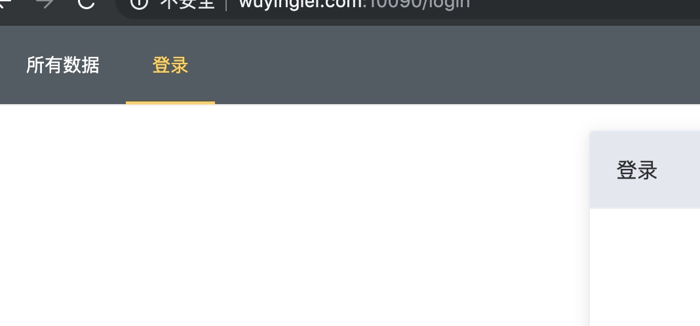
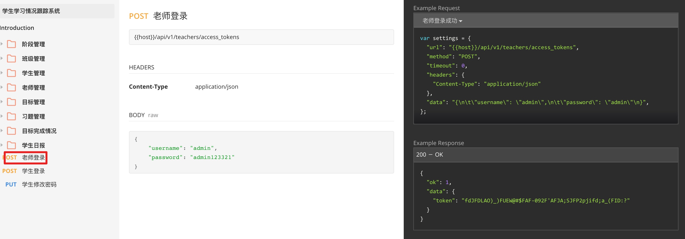

# 安装

## 使用 vue cli 创建项目

使用 vue cli 创建项目的指令：

~~~
vue create 项目名称
~~~

## 选择开发包

手动选择开发包：

选择开发包：

选择使用历史模式（将来上线部署时，需要特殊配置）：

用标准格式来格式化代码：

保存时格式化代码：

每个包的配置文件单独放：

# 路由

一般一个项目都是由多个页面组成的，这时为了在 VUE 中显示多个页面必须要使用路由！

## 分析页面的结构

## 实战：项目中添加首页和登录两个页面

1. 先注册子页面

router/index.js

2. 在 App.vue 中添加 router-view 标签

App.vue

效果：

# 接口通信

## 使用 axios

### 安装 axios 包

~~~
npm i axios
~~~

### 引入并配置

在 main.js 引入

## 模拟数据

我们在写前端时，需要调用后端的接口，但是有些时候，后端程序员可以还没有把后端接口写好，这时我们前端就无法开发了。

为了不受后端程序的影响 ，我们可以使用 `mockjs` 这个包来拦截、模拟 AJAX 的数据，这样完全不需要后端，我们也可以自己实现前台，真正的实现并行开发。

### 安装 mockjs 包

以开发模式 (-D） 来安装这个包，（只有开发时才会使用这个包，将来打包上线时不打包这个包的代码）

~~~
npm i mockjs -D
~~~

因为这个包只在开发时使用，上线之后会调用真正的接口了。

### 创建 mock.js 文件模拟接口

mock.js

~~~js
import Mock from 'mockjs'

// 模拟 /stduetns 接口
Mock.mock('http://localhost:7000/api/v1/students', {
  'data|1-10': [{
    'id|+1': 1,
    'student_name': '@cname',
    'age': '@integer(1,150)',
    'face': '@dataImage(80x80,棒棒哒)'
  }]
})

~~~

### 在main.js 中引入

main.js

加了这个之后，mock.js 文件会拦截相应的 AJAX 请求并返回模拟的数据：

这样以后前端就不需要依赖后端了。！！

### 把接口数据显示到页面中

效果：

## axios 中的拦截器添加令牌

服务器有一些接口必须要添加令牌才允许调用的。

向服务器传令牌：在使用 axiox 包调用接口时，在 HTTP 协议头中添加一个 `authorization` 属性，值就是要上传的令牌。

但是如果我们每次调用接口时都设置 HTTP 协议头比较麻烦，所以我们可以使用 `axios 的拦截器` ，它可以在每次发送请求之前自动令牌。

具体的做法：为 axios 包添加一个前置拦截器（每次请求之前自动执行）：

main.js

可以在浏览器查看协议头中是否有令牌：

# Vuex

## 应用场景

Vuex：状态管理器。

每个组件都可能拥有多种状态，比如：导航条就有两种状态

在未登录时的状态：

登录之后的状态：

Vuex 就是用来管理一个组件的状态的，为什么要使用 Vuex ？

一般情况下，一个组件的状态是由这个组件一来控制的，但是有些场景，一个组件的状态需要由其他的组件来控制，比如：

## 使用 vuex 管理导航条组件的状态

状态的代码写在 store/index.js 文件中。

vuex 由四部分组成：

1. state：状态数据
2. mutations：修改状态数据的方法
3. actions：修改状态数据的方法（异步修改，比如调用接口之后再修改状态数据）
4. getters：相当于计算属性

实际：

1. 先在 store/index.js 中定义状态管理的代码

2. 使用 vuex 中的 isLogin 数据来控制导航条的状态

3. 在登录页面中修改导航条的状态

之所以要把状态数据保存到 vuex 中，目的就是为了让其他任何一个组件都可以访问和修改这个数据。

4. 实现退出功能

修改 App.vue 文件，引入 store/index.js 中的 logout 方法并绑定到 退出按钮上：

总结：当要跨页面控制组件时，需要使用 vuex （组件间通信）。

# 实战：通过登录接口实现登录的功能

## 查看接口文档

## 模拟接口数据

## 登录页面实现

调用接口实现登录功能

## sessionStorage 和 localStorage 的区别？

我们在保存令牌时可以使用 `sessionStoarge` 和 `localStoarge` 的：

sessionStorage：关闭浏览器之后，数据就会被删除。

localStorage：永久的保存在浏览器中，除非手动删除。

效果：

1. sessionStorage 保存令牌：关闭浏览器，再重新打开就是退出的状态，需要重新登录。（令牌被删除了）
2. localStorage 保存令牌：关闭浏览器，再打开浏览器还是登录的状态。（令牌还在）

