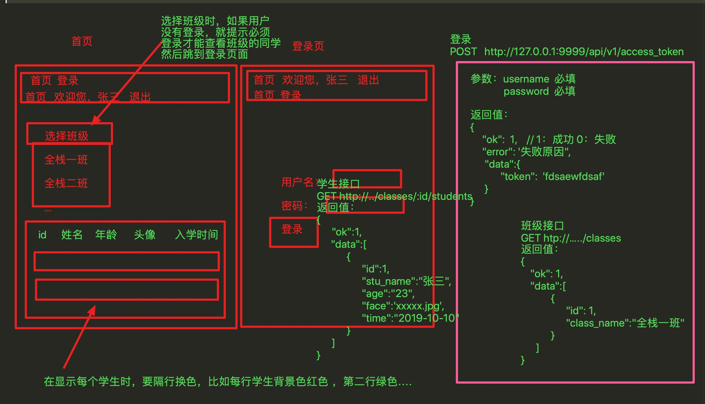

考题：

1. 有两个页面：首页、登录页
2. 每个页面上面都有导航条，导航条有两种状态：登录和未登录
3. 在首页中有一个下拉框：显示所有的班级（班级中的数据是通过接口获取的）
4. 当用户选择一个班级时：如果用户登录了，就在下面的表格中显示出这个班级的学生，如果这个用户没有登录，那么就提示必须登录才能显示这个班级的学生
5. 下面表格中显示的学生，要实现隔行换行，每一条记录的背景色不同，比如，第一个学生背景色红色，第二个学生背景色绿色 ，第三个学生背景色红色。。。。
6. 三个接口，自己使用 mockjs 模拟数据实现
7. 可以查文档、上网、查询资料，但是不能拷贝其他同学的代码，也不能问其他同学。
8. 做完之后，举手，老师检查代码和功能，如果问题就可以自由活动了，如果上午做不出来，下午过来，老师带着你做一遍！

