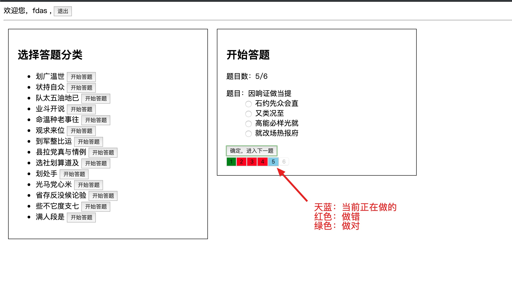

# 最终效果

# 安装项目

1. 先创建项目

~~~
vue create 
~~~

2. 安装依赖包

安装 axios 包

~~~
npm i axios
~~~

安装 mockjs 包

~~~
npm i mockjs -D
~~~

# 入口文件

main.js

~~~js
import Vue from 'vue'
import App from './App.vue'
import router from './router'
import store from './store'
import axios from 'axios'

import './mock'

axios.defaults.baseURL = 'http://localhost:7777/api/v1'

Vue.prototype.$http = axios

Vue.config.productionTip = false

new Vue({
  router,
  store,
  render: h => h(App)
}).$mount('#app')

~~~

# 制作登录页

views/Login.vue

~~~vue
<template>
  

    <h1>登录页</h1>
    
用户名：<input v-model="loginForm.username" type="text" />

    
密码：<input v-model="loginForm.password" type="text" />

    
<button @click="login">登录</button>

  

</template>

~~~

# 注册登录路由

router/index.js

~~~js
import Vue from 'vue'
import VueRouter from 'vue-router'
import Home from '../views/Home.vue'

Vue.use(VueRouter)

const routes = [
  {
    path: '/',
    component: Home
  },
  {
    path: '/login',
    component: () => import('../views/Login.vue')
  }
]

const router = new VueRouter({
  mode: 'history',
  base: process.env.BASE_URL,
  routes
})

export default router
~~~

# 制作首页

views/Home.vue

~~~vue
<template>
  

    欢迎您，{{username}} ,
    <button @click="logout">退出</button>
    

    <!-- 显示分类 -->
    

      <h2>选择答题分类</h2>
      <ul>
        <li v-for="(item, index) in categories" :key="index">
          {{item.cat_name}}
          <button @click="getQuestions(item.id)">开始答题</button>
        </li>
      </ul>
    

    <!-- 答题 -->
    

      <h2>开始答题  </h2>
      
0">题目数：{{current_question_key+1 + '/' + questions.length}}

      <dl v-if="questions.length>0">
        <dt>题目：{{questions[current_question_key].title}}</dt>
        <dd v-for="(item, index) in questions[current_question_key].options" :key="index">
          <label>
            <input type="radio" name="xx" :value="index" v-model="answers[current_question_key]">
            {{item}}
          </label>
        </dd>
      </dl>
      <button @click="next">确定，进入下一题</button>

      <!-- 显示所有题的按钮 -->
      

        <button
        :class="{
          active: current_question_key === index,
          wrong: answers.length > index && answers[index] !== questions[index].answer,
          right: answers[index] === questions[index].answer,
        }"
        @click="current_question_key=item-1"
        :disabled="index>current_question_key_rd"
          v-for="(item, index) in questions.length"
          :key="index">
          {{item}}
        </button>
      

    

  

</template>

~~~

# App.vue

app.vue

~~~vue
<template>
  <router-view></router-view>
</template>

~~~

