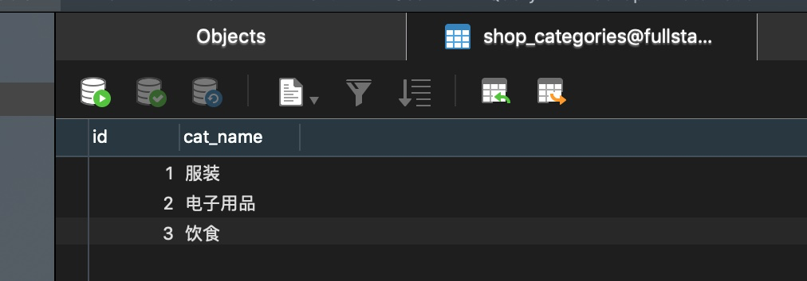
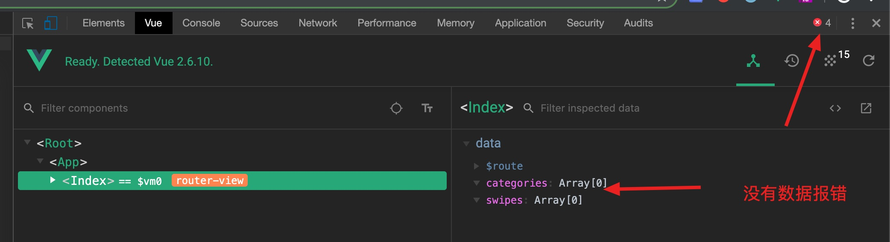
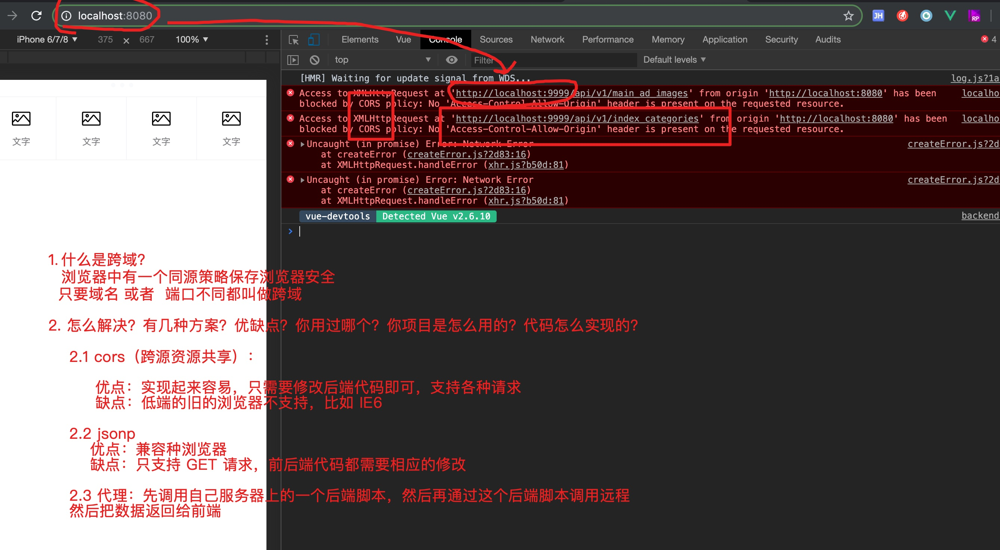
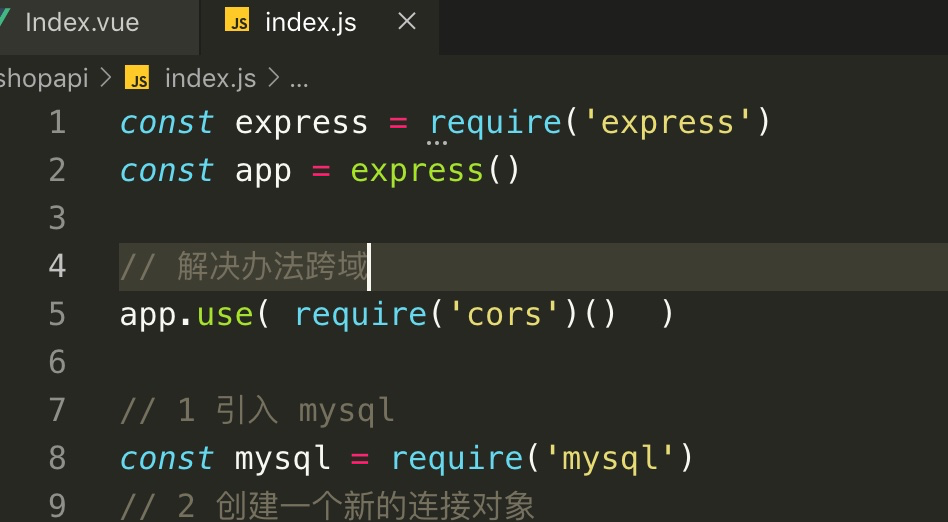

# 商城系统后端接口实现

## 首页轮播接口实现

### 建库

### 建表

一般表中第1个字段都是ID字段：

规范：

1. 每张表名设置一个前辍
2. 表名和字段名全部使用小写，多个单词之间用 _ 隔开

### 编写后端代码

1. 创建项目目录

2. npm 项目初始化

~~~
npm init -y
~~~

3. 安装依赖包

~~~
npm i express mysql cors
~~~

cors：解决跨域。

4. 编写入口文件

4.1 启动一个 HTTP 接口服务器

~~~js
const express = require('express')
const app = express()

// 启动服务器
app.listen(9999, ()=>{
    console.log('成功！监听：127.0.0.1:9999!')
})
~~~

4.2 为接口定义路由

4.3 连接数据库

4.4 给前端返回数据

5. 启动

启动后端程序至少 3 种

- 方法一、使用 node

~~~
node 入口文件
~~~

缺点：

​			a. 单进程单线程，无法充分电脑的多核心 CPU

​			b. 只要程序上出错，系统就崩溃

总结：`不要使用`

- 方法二、使用 nodemon

~~~
nodemon 入口文件
~~~

好处：每次保存文件时，系统自动重新启动

总结：`开发时使用`

- 方法三、使用 pm2

~~~
pm2 start 入口文件
~~~

总结： `系统线上使用这个`

好处：

​				a. 多进程：帮我们开启多进程充分利用多核心cpu

​				b. 高可用功能：如果有有程进程崩溃了，那么它会帮我们马上再创建一个进程，保存系统能够稳定的长时间 运行，不会因为某一个错误而导致系统崩溃

使用方法：

​	a. 全局安装 pm2

~~~
npm i pm2 -g
~~~

​    b. pm2 中提供了几个指令

可以通过 `pm2 -h` 查看所有指令：

其中常用的有：

效果：

6. 测试

先在表中添加几条测试数据：

然后浏览器中访问：

## 首页推荐分类

### 建表

### 编写接口代码

### 测试接口

效果：

# 商城首页前端实现

## 创建项目

~~~
vue create shopapp
~~~

## 安装依赖包

~~~
npm i axios vant
~~~

## 先引入和配置依赖名

main.js

## 首页

### 清空根页面

### 配置路由

### 制作首页

a. 制作 把组件放到

b. 调用接口取数据

测试接口数据是否获取成功：

查看错误信息、跨域：

使用 cors 来解决。具体做法：

后端需要做的：

1. 先安装 cors

~~~
npm i cors
~~~

2. 添加一行代码

~~~
const cors = require('cors')
app.use(cors())
简化成一行：
app.use(require('cors')())
~~~

效果：

测试效果：

模板中显示数据：

效果：

# 首页商品的滚动加载

## 使用 Mock

a. 先安装 mockjs

~~~
npm i mockjs -D
~~~

b. 编写 mock

src/mock.js

~~~
正则扩展：

\d：1 个数字

修饰数量：

*：0~多个
		ab*：一个a，0~多个b，比如：a , ab  , abbb, abbbb, abbbbb
?：0~1个
		ab?：一个a，0~1个b，比如： a  、 ab
+：1~多个
			a+：1~多个 a
          ab+：1个a和1~多个b，比如：ab 、abb、abbb、abbbb

~~~

~~~
Mock.mock(/http:\/\/localhost:9999\/api\/v1\/index_goods\?page=\d+&per_page=\d+/, 'get', {
	'ok': 1,
	'data|10': [{
		'id|+1': 1,
		'goods_name': '@ctitle',
    'price': '@integer(10,9999)',
    'image': '@dataImage(130x130)'
	}]
})
~~~

c. 在 main.js 中引入

~~~
import './mock'
~~~

## 获取第一屏的10件商品

效果：

## 显示商品

- 使用插槽设置图标内容：

效果：

- 使用插槽设置文字的内容

CSS 美化：

## 滚动加载

实现原理：使用 `van-list` 组件。

这个组件有 3 个最核心的属性（不能没有）：

实现：

## 首页最多加载50条

实现原理：当加载了50条之后把 finished 属性设置 true 就可以禁止再次加载。

加载完之后显示汉字：

效果：

